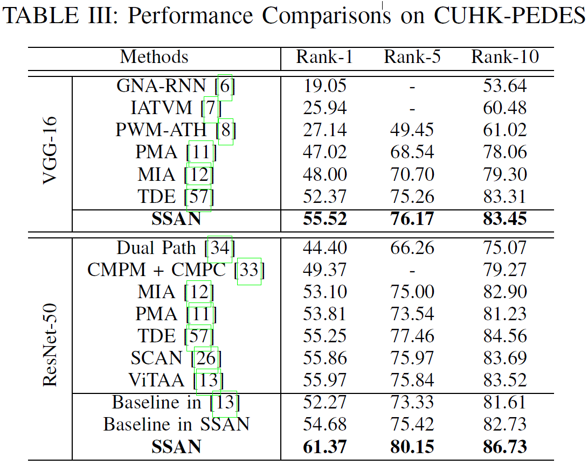
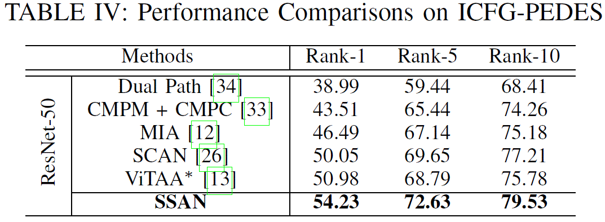

# Semantically Self-Aligned Network for Text-to-Image Part-aware Person Re-identification

 

We provide the code for reproducing result of our  paper [**Semantically Self-Aligned Network for Text-to-Image Part-aware Person Re-identification**](https://arxiv.org/pdf/2107.12666.pdf). 

## Getting Started
#### Dataset Preparation

1. **CUHK-PEDES**

   Organize them in `dataset` folder as follows:
       

   ~~~
   |-- dataset/
   |   |-- <CUHK-PEDES>/
   |       |-- imgs
               |-- cam_a
               |-- cam_b
               |-- ...
   |       |-- reid_raw.json
   
   ~~~

   Download the CUHK-PEDES dataset from [here](https://github.com/ShuangLI59/Person-Search-with-Natural-Language-Description) and then run the `process_CUHK_data.py` as follow:

   ~~~
   cd SSAN
   python ./dataset/process_CUHK_data.py
   ~~~

2. **ICFG-PEDES**

   Organize them in `dataset` folder as follows:

   ~~~
   |-- dataset/
   |   |-- <ICFG-PEDES>/
   |       |-- imgs
               |-- test
               |-- train 
   |       |-- ICFG_PEDES.json
   
   ~~~

   Note that our  ICFG-PEDES is collect from [MSMT17](https://github.com/pkuvmc/PTGAN) and thus we keep its storage structure in order to avoid the loss of information such as camera label, shooting time, etc. Therefore, the file `test`and `train` here are not the way ICFG-PEDES is divided. The exact division of ICFG-PEDES is determined by `ICFG-PDES.json`. The `ICFG-PDES.json` is organized like the `reid_raw.json` in [CUHK-PEDES](https://github.com/ShuangLI59/Person-Search-with-Natural-Language-Description) .

   Please request the ICFG-PEDES database from [chxding@scut.edu.cn](mailto:chxding@scut.edu.cn) and then run the `process_ICFG_data.py` as follow:

   ~~~
   cd SSAN
   python ./dataset/process_ICFG_data.py
   ~~~

#### Training and Testing
~~~
sh experiments/CUHK-PEDES/train.sh 
sh experiments/ICFG-PEDES/train.sh 
~~~
#### Evaluation
~~~
sh experiments/CUHK-PEDES/test.sh 
sh experiments/ICFG-PEDES/test.sh 
~~~

## Results on CUHK-PEDES and ICFG-PEDES

**Our Results on CUHK-PEDES dataset**

**Our Results on ICFG-PEDES dataset**

## Citation

If this work is helpful for your research, please cite our work:

~~~
@article{ding2021semantically,
  title={Semantically Self-Aligned Network for Text-to-Image Part-aware Person Re-identification},
  author={Ding, Zefeng and Ding, Changxing and Shao, Zhiyin and Tao, Dacheng},
  journal={arXiv preprint arXiv:2107.12666},
  year={2021}
}
~~~
